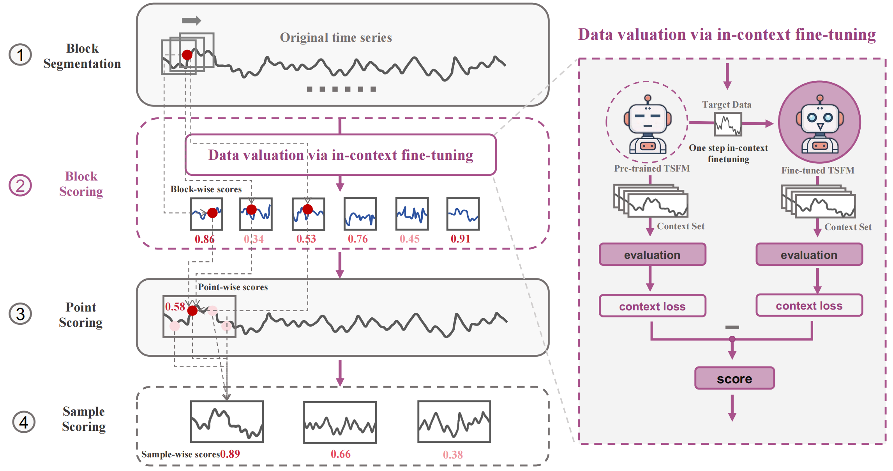

# Lightweight Time Series Data Valuation on Time Series Foundation Models via In-Context Finetuning

This is the official repository for our paper **Lightweight Time Series Data Valuation on Time Series Foundation Models via In-Context Finetuning and contains code for:
1. Data preparation
2. 5-folds valuation on Time-moe
3. Scoring time series data samples
4. Differentiate between high- and low-quality data
5. Evaluating LTSV on Time-Series-Library and other models



## Data preparation

In the process of evaluating time series data quality using Time-MoE, we adopted a five-fold cross-validation strategy, where each subset of data serves as a validation set in turn. The five folds were prepared separately. After applying a sliding window segmentation with a step size of 100, we obtained a complete dataset containing 1,000 sequences. Subsequently, 30% of the data was reserved for future evaluation, while the remaining 70% was used for training. The training portion was then divided into five equal subsets using a fixed random seed, which served as the input for the five-fold cross-validation process.


## Guidance for evaluating

This repository does not provide a single run script.
Instead, the evaluation and fine-tuning pipeline is fully contained within the main Python file, which can be executed directly via command line arguments.

The script is designed for lightweight data valuation on time series foundation models (TSFMs) using in-context fine-tuning.

##### example:

```python

python run_ltsv.py \
    --base_model Maple728/TimeMoE-50M \
    --data_dir /root/WEA \
    --output_dir /root/WEA \
    --batch_size 1 \
    --context_length 76 \
    --prediction_length 24 \
    --datasets WEA1.jsonl WEA2.jsonl WEA3.jsonl WEA4.jsonl WEA5.jsonl

```

All arguments are defined via argparse and can be customized according to your experimental setup.


### ⚙️ Parameter Description

| Argument | Type | Default | Description |
|----------|------|---------|-------------|
| `--base_model` | str | `"Maple728/TimeMoE-50M"` | Base TSFM to be fine-tuned and evaluated |
| `--data_dir` | str | `"/root/Time-MoE/WEA"` | Directory containing dataset JSONL files |
| `--output_dir` | str | `"/root/Time-MoE/WEA_R"` | Directory to store results and logs |
| `--batch_size` | int | 1 | Batch size for model evaluation |
| `--context_length` | int | 76 | Input sequence length for the model |
| `--prediction_length` | int | 24 | Prediction horizon |
| `--datasets` | list[str] | `[WEA1.jsonl,ect]` | List of datasets for cross-fold evaluation |

## Datasets

The following table summarizes the datasets employed in this project for different forecasting and classification tasks. All datasets can be downloaded from Hugging Face or accessed via https://drive.google.com/drive/folders/13Cg1KYOlzM5C7K8gK8NfC-F3EYxkM3D2

| **Task**                   | **Dataset**s                                 |
| -------------------------- | -------------------------------------------- |
| **Long-term Forecasting**  | Electricity, Exchange Rate, Traffic, Weather |


### Evaluating
## Evaluating

The `run.py` script provides a unified interface for **training and evaluating time series models** across multiple tasks, including long-term forecasting, short-term forecasting, imputation, classification, and anomaly detection. You can evaluate a pre-trained model or perform full training followed by evaluation.

### Example: Long-term Forecasting

```bash
export CUDA_VISIBLE_DEVICES=2

model_name=PAttn

python -u run.py \
  --task_name long_term_forecast \
  --is_training 1 \
  --root_path ./dataset/ETW2/ \
  --data_path 1-20ETM2.jsonl \
  --model_id E0wesd2 \
  --model $model_name \
  --data custom \
  --features S \
  --seq_len 50 \
  --label_len 10 \
  --pred_len 40 \
  --e_layers 2 \
  --d_layers 1 \
  --factor 3 \
  --enc_in 7 \
  --dec_in 7 \
  --c_out 7 \
  --des 'Exp' \
  --itr 1 \
  --use_gpu 0 \
  --seed 42

```


## Citation

```bibtex
@inproceedings{jin2024time-llm,
  title     = {Time-LLM: Time Series Forecasting by Reprogramming Large Language Models},
  author    = {Jin, Ming and Wang, Shiyu and Ma, Lintao and Chu, Zhixuan and Zhang, James Y. and Shi, Xiaoming and Chen, Pin-Yu and Liang, Yuxuan and Li, Yuan-Fang and Pan, Shirui and Wen, Qingsong},
  booktitle = {Proceedings of the International Conference on Learning Representations (ICLR) 2024 Poster},
  year      = {2024},
  url       = {https://github.com/KimMeen/Time-LLM}
}

@inproceedings{shi2025time-moe,
  title     = {Time-MoE: Billion-Scale Time Series Foundation Models with Mixture of Experts},
  author    = {Shi, Xiaoming and Wang, Shiyu and Nie, Yuqi and Li, Dianqi and Ye, Zhou and Wen, Qingsong and Jin, Ming},
  booktitle = {Proceedings of the International Conference on Learning Representations (ICLR) 2025 Spotlight},
  year      = {2025},
  url       = {https://github.com/Time-MoE/Time-MoE}
}